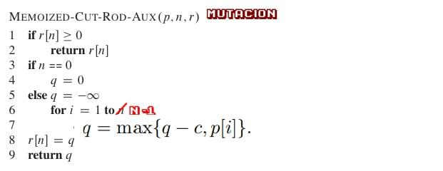
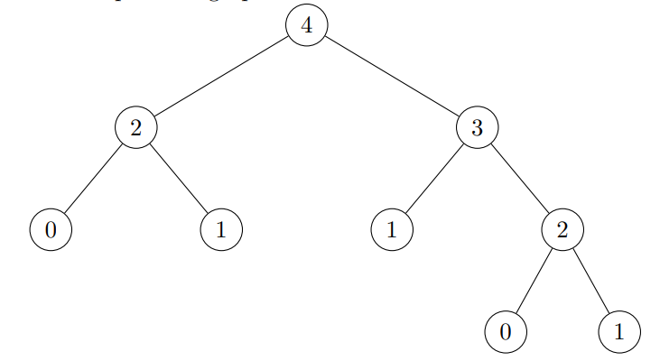
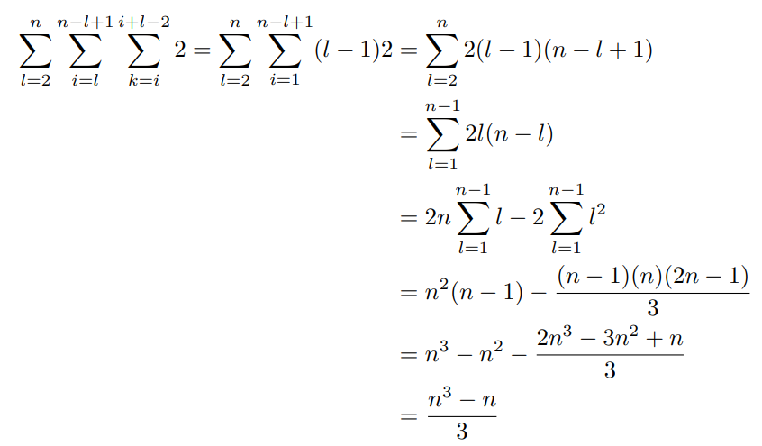

# Sección 15
## 15.1
### 15.1-1
El caso base es $T(0) = 2^0$ y como $\forall ~r \in \R:r \neq 0, r⁰ = 1$ entonces $T(0) = 1$ usando hipotésis inductiva y tenemos:  
$T(n) = 1 + \sum_{j=0}^{n-1}T(j) = 1 + \sum_{j=0}^{n-1}2^j = 1 + \frac{2^n -1}{2 -1} = 1 + 2^n - 1 = 2^n$

### 15.1-2
Tomando $p_1=0, p_2 = 4, p_3 = 7, n=4 $ usando greedy, primero cortaríamos una pieza de tamaño 3 ya que esta tiene la mayor densidad, el resto de la barra tiene una longitud de 1, por lo tanto el precio es de 7. Otro camino es tomar dos varras de longitud 2 con precio de 8.

### 15.1-3
tenemos:  
$r_n = max\{p_n, r_1 + r_{n-1} - c, r_2 + r_{n-2}-c, ..., r_{n-1} + r_1 -c  \}$  
Con lo que el algoritmo queda:  

### 15.1-4
Crear un nuevo array llamado s, inicializarlo llenos de 0 en _MEMOIZED-CUT-ROD(p,n)_ y mandarlo como argumento a _MEMOIZED-CUT-ROD-AUX(p,n,r,s)_.  
Reemplazar la línea 7 en el auxiliar con lo siguiente:  
t = p[i] + MEMOIZED-CUT-ROD-AUX(p,n-i,r,s).  
if $t < q$ set $q = t$ y $s[n] = i$  
Y tendremos que $s[i]$ contendrá el tamaño del primer corte de la barra de tamaño i

### 15.1-5
EL grafo del subproblema donde $n = 4$ queda:
  
El número de vertices en el arbol para computar el n-ésimo número de Fibonacci segurirá:  
$V(n) = 1 + V(n-2) + V(n-1)$  
Con la condición inicial $V(1) = V(0) \therefore V(n) = 2* Fibonacci(n) - 1$  
Veamoslo por inducción:  
$V(n) = 1+ 2 * Fibonacci(n-2)-1+2*Fibonacci(n-1)-1 = 2 * Fibonacci(n) -1$  

El número de _edges_ seguirá:  
$E(n) = 2 + 3(n-1) + E(n-2) $  
Nuestro caso base es $E(1) = E(0)$ entonces usando $E(n) = 2*Fib(n) - 2$ en inducción tenemos:  
$E(n) = 2+ 2* Fib(n-1) -2 +2*Fib(n-2)=2*Fib(n)-2$

Tenemos complejidad O(n) usando bottom-up

## 15.2
### 15.2-1
Un optimo uso de los parentesis para la secuencia sería:  
$(A_1 A_2)((A_3 A_4)(A_5 A_6))$  
Con lo que tenemos:  
$5 * 50 * 6 + 3 *12 * 5 +5 * 10 *3 +3 *5 *6+5*3*6 = 1500 + 180 + 150 + 90 + 90 =2010$

### 15.2-2
algortimo DYN-FIB(n)
1. anterior = 1
2. anteAnterior = 1
3. if n <= 1:
    1. return 1
4. for i = 2 hasta n:
    1. tmp = anterior + anteAnterior
    2. anteAnterior = anterior
    3. anterior = tmp
5. return anterior

Algoritmo Matrix-Chain-Multiply(A,s,i,j)
1. if i == j then:
    1. return A
2. return  Matrix-Chain-Multiply(A,s,i,s[i,j]) * Matrix-Chain-Multiply(A,s,s[i,j]+1,j)

### 15.2-3
Vamos a usar inducción para mostrar que $P(n)$ de (15.6) es $>= 2^n -1 \in \Omega (2^n)$ el caso base donde $n=1$ es trivial. Entonces para $n >= 2$ tenemos:  
$ P(n) = \sum_{k=1}^{n-1}P(k)P(n-k) >= \sum_{k=1}^{n-1}2^k 2^{n-k} = (n-1)(2^n-1) >= 2^n -1 $

### 15.2-4
El subproblema para _matrix chain multiplication_ tiene un vértice para cada par (i,j) tal que $1 \leq i \leq j \leq n$ esto corresponde a encontrar el camino óptimo para multilpicar $A_iS_{i+1} ... A_j$  
Hay $n(n-1)/2+n$ vértices. VErtex(i,j) está conectado por un _edge_ directamente al vertex(k,l) si $k = i$ y $k \leq l <j$ o $l=j$ y $i < k \leq j$. Un vertex(i,j) tiene _outdegree_ 2(j-i).  
Tenemos $n- k$ vértices tal que $j -i = k, \therefore \sum_{k=0}^{n-1}2k(n-k)$ es el número total de vértices.

### 15.2-5
Tenemos que contar cuantas veces referenciamos una entrada distinta en m contra lo que estmoas computandi, esto es 2 veces el número de veces corre 10 líneas:  

## 15.3
### 15.3-1
El tiempo de ejecución de enumerar is $n*P(n)$ si usaramos _RECURSIVE-MATRIX-CHAIN_ ya que tiene que pasar por todos los nodos internos del árbol, además el acercamiento por enumaración no tiene _overhead_

### 15.3-2
Sea [i,...,j] los parametros que recibe Merge Sort donde i es la posición ordenada y j la posición del arreglo original. El árbol de recursión tendrá [1...n] como raíz y encada nodo [i,,,j] tendrá [i...(j-i)/2] y [(j-i)/2+...j] en los nodos hijo izquierda y derecha respectivamente.  
Si $i - j = 1$ entonces no habrá nodos hijo. _memoization_ falla al mejorar el tiemp ode Merge Sort debido a que los subproblemas no se empalan.

### 15.3-3
Esta modificaicón del problema de matrices continua mostrando una subestructura óptima. Supongamos que partimos un multiplicador máximo de $A_1,A_2,...A_n$ entre $ A_k $ y $A_{k+1}$ de modo que tenemos un costo máximo multiplicativo en el otro lado, de otra manera podríamos sustituir para ese lado en una multiplicación más costosa de $A_1,...A_n$

### 15.3-4
Supongamos que tenemos mátrices $A_1, A_2, A_3$ y $A_4$ de dimensiones $p_0,p_1,p_2,p_3,p_4 = 100,100,20,10,1000$ entonces $p_op_kp_4$ son minimizados cuando $k=3$, entonces tenemos que resolver el subproblema de multiplicar $A_1 A_2 A_3 A_4$ el cual se resuelve automaticamente. Por su algoritmo, esto se resuelve al partir en $k = 2$, la operación nos queda:  
$(((A_1 A_2)A_3)A_4)$  
$1000 * 100 * 20 + 1000 * 20 * 10 + 100 *10 *1000 = 12200000$

Por otro lado supongamos esto:  
$((A_1(A_2 A_3))A_4)$ :  
$100 * 20 * 10 + 1000 * 100 * 10 + 1000 *10 *1000 = 11020000$

### 15.3-5  
Hay que recordar que el número de piezas de longitud i usadas de un lado del corte, afectará el número permitido del otro lado, por lo que ya no se mantiene la propiedad de subestructura óptima.  
Ahora, supongamos que la longitud de la barra es 4, los valores son: $l_1 = 2, l_2 = l_3 = l_4 = 1$ y cada pieza vale lo mismo apesar de su tamaño, así, si cortamos a la mitad, esa será nuestra solución óptima, pero esto no es válido ya que la longitud permitida ya que incrementa el número total de barras de tamaño 1.

## 15.4
### 15.4-1
Un LCS es (1,0,1,0,1,0), notamos que la primera lista contiene un "00" mientras que la segunda contiene none, ademas, la segunda lista contiene dos copias de "11", mientras que la primera no, por lo que cualquier LCS deberá omitir por lo menos 3 élementos, por lo que sabemos que nuestra sub secuencia común era máxima

### 15.4.2
El algoritmo _PRINT-LCS(c,X,Y)_ imprime el LCS de X y Y desde la tabla completa computando solamente las entradas necesarias B; esto es de complejidad $O(m + n)$ ya que cada iteración del loop *while* decrecen en 1 i o j o inlcuso ambos y al final se itera a lo más en $min(m,n)$ veces

### 15.4-4
Como solo usamos el renglón anterior de la tabla c para computar el renglón anterior, pero cuando vamos a computar el renglón k, liberamos el renglón $k-2$ ya que no es necesario. podemos usar aún menos espacio, al computar c[i,j] necesitamos las entradas c[i-1,j], c[i-1,j-1] y c[i,j-1] podemos liberar el renglón anterior de modo _entryByEntry_ ya que no los necesitaremos de nuevo, llegamos al un espacio min(m,n).Computar la siguiente entrada del árbol nos tomará O(1) en tiempo y espacio.

### 15.4-5
Dada una lista de números L, debemos hacer una copía de L a la que llamaremos L' y esa copia es la que se ordena:  
**Print-LCS(c,X,Y)**  
1. n = c[X.length, Y.length]
2. s = [ ] : s.length = n.length
3. i = X.length && j = Y.length
4. while i > 0 && j > 0 :
    1. if $x_i == y_i$ :
        1. s[n] = $x_i$
        2. n = n - 1
        3. i = i - 1
        4. j = j - 1
    2. elif c[i -1, j] $\geq$ c[i, j -1] :
        1. i = i -1
    3. else
        1. j = j - 1
5. for k = 1 hasta s.length:
    1. print s[k]

**MEMO-LCS-LENGTH-AUX(X,Y,c,b)**
1. m = |x|
2. n = |y|
3. if $c[m,n]! = 0$ || $m == 0$ || $n == 0$ :
    1. return
4. if $x_m == y_n$ :
    1. b[m,n] = c[m,n] = MEMO-LCS-LENGTH-AUX(X[1,..., m - 1], Y[1, ... , n - 1]c,b) + 1
    2. elif MEMO-LCS-LENGTH-AUX(X[1,..., m - 1], Y,c,b) $\geq$ MEMO-LCS-LENGTH-AUX(X,Y[1,.., n - 1], c, b) :
        1. b[m,n] = c[m,n] = MEMO-LCS-LENGTH-AUX(X[1,.., m - 1], Y,c,b)
    3. else :
        1. b[m,n] = c[m,n] = MEMO-LCS-LENGTH-AUX(X,Y[1, .. , n-1],c,b)

**MEMO-LCS-LENGTH(X,Y)**
1. let c be a (reference) arreglo de tamaño |X| x |Y| inicializado en 0's
2. let b be a (reference) arreglo de tamaño |X| x |Y|
3. MEMO-LCS-LENGTH-AUX(X,Y,c,b)
4. return c && b

Entonces, debemos correr el algoritmo LCS recibiendo como parámetro las dos listas, la subsecuencía común más larg debería incrementar de forma monótona debido a las subsecuencías de la lista ordenada L' solo se agrega esa misma reestricción. Ahora, |L| = |L'| = n y ordenando L, se realiza en $O(n²)$ y el tiempo final queda en $O(|L| |L'|) = O(n²)$  