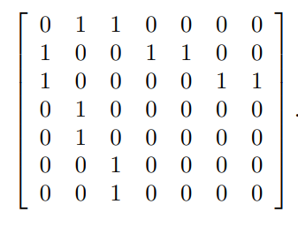

### 22.1-1
Denotando con v cada vértice, el encontrar la longitud de cada uno nos tomará $O(outDegree(v))$, entonces el costo total será:  
$\sum_{v \in V} O(outDegree(v)) = O(|E| + |V|)$.  
Podemos reducir este tiempo a $O(|V|)$ si por cada lista de adyacencia, restauramos la longitud.  
Para computar los grados de cada vértice debemos ir por toda la lista y llevar contadores de cuantas veces ha aparecido cada vértice, el tiempo de escanear una lista de adyacencia es de $O(|E| + |V|)$ 

### 22.1-2
La lista de adyacencia queda:
1. 2,3
2. 1,4,5
3. 1,6,7
4. 2
5. 2
6. 3
7. 3

Y la matriz queda:  

### 22.1-3
Para computar el transpuesto de un grafo, debemos tomar la matriz transpuesta de la representación de matriz del grafo,esto toma tiempo $O(|V²|)$.  
Para la lista de adyacencia, iniciamos con una lista vacía, luego _escaneamos_ la lista de adyacencia original, si en esta lista original observamos correspondencia entre un vértice $v$ y una entrada $u$, entonces agregamos $v$ a lalista transpuesta correspondiente al vértice $u$, esto es más eficiente que trabajar con matrices, nos toma tiempo $O(|E|+|V|)$

### 22.1-4
CReamos un arreglo A de tamaño $|V|$, para una lista de adyacencia correspondiente al vértice $v$, revisar los _items_ en la lista uno por uno, si algpun _item_ es igual a $v$, entonces lo eliminamos. Si el vértice $u$ aparece en la lista, hay que revisar $A[u]$. si no es igual a $v$ entonces lo igualamos, si desde un inicio ya es igual a $v$, quitamos $u$ de la lista, esto nos toamría tiempo $O(V + E)$

### 22.1-6
Empezando en la posición (1,1) en la matriz de adyacencia, cuando examinamos la posición $(i,j)$, si encontramos un 1, revisamos la posición $(i + 1, j)$. Si encontramos un 0, entonces revisamos la posición $(i, j +1)$, si cualquiera de los dos i o j son iguales a $|V|$, acabamos.
AHora supongamos el vértice $k$ es un _universal sink_, por lo que el renglón de K en la matriz de adyacencia, será de puros 0's y la columna k, será de puros 1's, excepto en (k,k) donde habrá un 0, entonces en nuestro algoritmo, cuando se alcance el renglón k, el algoritmo sigue incremenentando j hasta que $j = |V|$, y para asegurarnos que se alcance ese punto, se debe incrementar i hasta que lleguemos a k.  
Este algoritmo corre en O(V), revisar si i es o no _sink_ nos toma O(V), por lo que el proceso entero nos toma O(V) 